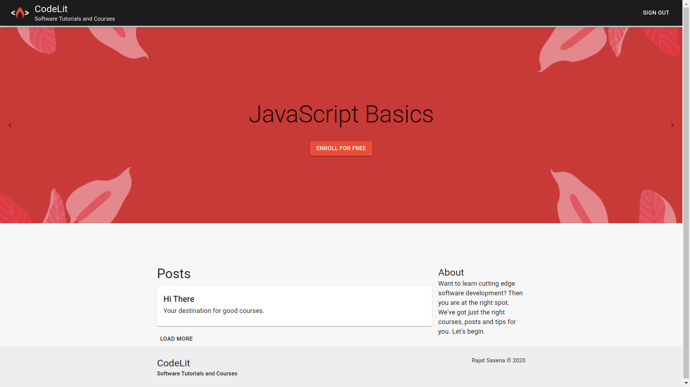

[](https://github.com/codelit/courselit/blob/deployment/LICENSE)
[](https://github.com/codelit/courselit/actions)


# Introduction
CourseLit is a decoupled content management system (CMS) for teachers and course creators.



## Setup
### Local
- Install MongoDB
- Install imagemagick, ffmpeg
- Create two folders `uploads` and `thumbs` in your home folder or set an environment variable `MEDIA_FOLDER` where the prior mentioned folders are located.

## Testing
### Backend
- Install MongoDB locally
- Start the test server
    ```
    yarn test:server
    ```
- Run the unit tests
    ```
    yarn test:unit
    ```

## Creating Super Admin
The very first user who signs up for an account, automatically becomes a super admin.

## Deployment

### 1. DigitalOcean
- Go to DigitalOcean's API section.
- Generate a personal access token and copy it to clipboard.
- Create a `.prod.env` file in your project's directory, copy-paste the following and change the settings as per your target environment
  ```
  MAIN_URL=http://localhost
  API_PREFIX=/api
  MOUNT_UPLOAD_FOLDER_VOLUME_AS=~/courselit/uploads
  MOUNT_THUMBNAIL_FOLDER_VOLUME_AS=~/courselit/thumbs
  MOUNT_MONGO_VOLUME_AS=~/courselit/mongo
  JWT_SECRET=yoursecret
  JWT_EXPIRES_IN=864000
  MONGO_DB_NAME=app
  MONGO_ROOT_USERNAME=username
  MONGO_ROOT_PASSWORD=password
  ```
- Create a Docker machine
  ```
  docker-machine create --driver digitalocean --digitalocean-access-token xxxxx machine-name
  ```
- Run the following command to see your running Droplet.
  ```
  docker-machine ls
  ```
- Export proper Docker variables in your shell.
  ```
  docker-machine env machine-name
  ```
- SSH into your docker machine.
  ```
  docker-machine ssh machine-name
  ```
- Install Letsencrypt's Certbot from [here](https://certbot.eff.org/lets-encrypt/ubuntuxenial-haproxy)
- Copy-paste the content of the `configure-server-for-letsencrypt` in a script on your docker machine and execute it.
- Log out of your docker machine.
- Start the docker containers.
  ```    
  ./up machine-name .prod.env
  ```

## Security
Although, we've done everything in our power to secure the application by following the best practices, we hope you understand that no one can guarantee that it's the most secure implementation out there and it will always stay secure.

Please audit the environment files, docker-compose files and other configurations properly as per your company's security standards. If you've discovered a security vulnerability, consider fixing the issue and submitting a PR.